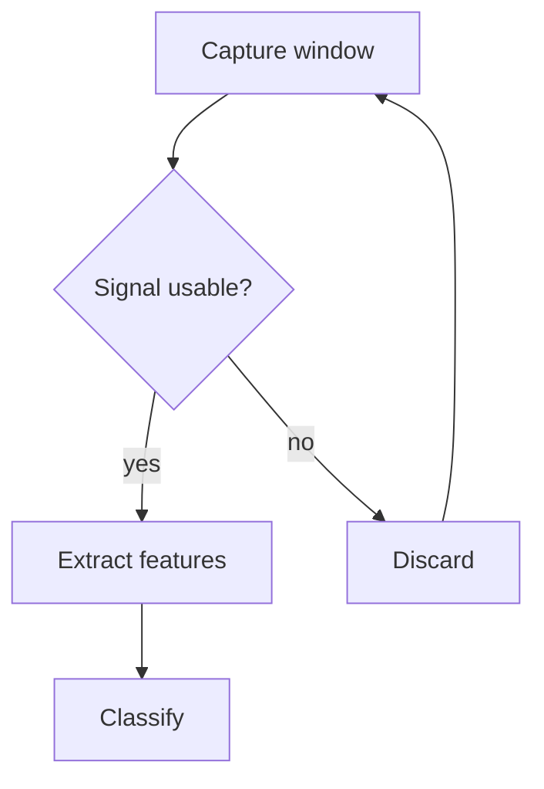
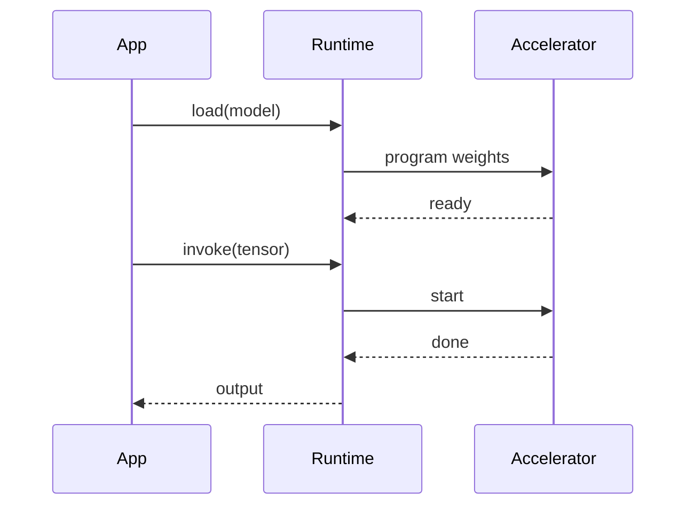
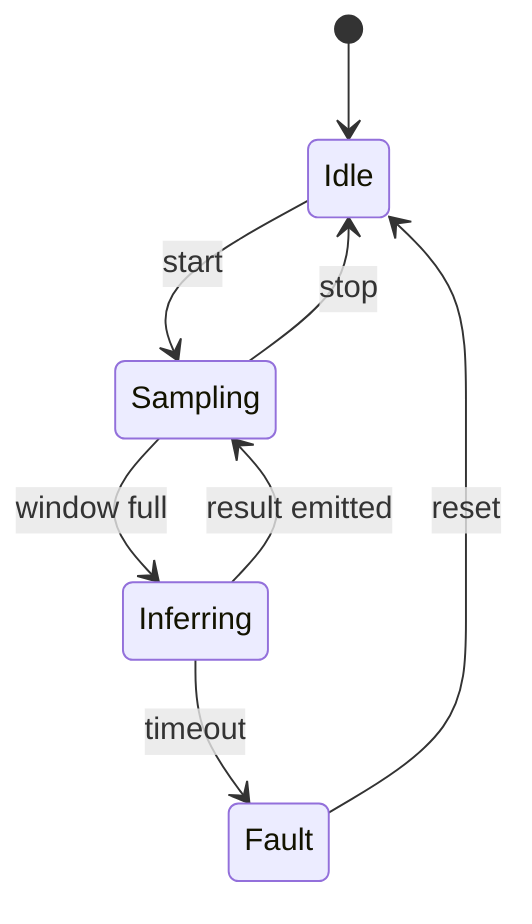

import Callout from '@ambiqai/helia-ui/astro/Callout';

A ` ```mermaid ` fence becomes an inline SVG at build time. The page ships no
diagram runtime, the diagram is in the HTML before any script runs, and the
colors come from the same tokens as the rest of the page, so a diagram follows
the light and dark themes without a palette of its own.

## Turning it on

Two things: the rehype plugin, which replaces the fence with an SVG, and the
theme sheet, which paints it.

```js
// astro.config.mjs
import rehypeMermaid from 'rehype-mermaid';

export default defineConfig({
  markdown: {
    rehypePlugins: [[rehypeMermaid, { strategy: 'inline-svg' }]],
  },
  integrations: [
    starlight({
      customCss: [
        './src/styles/tailwind.css',
        '@ambiqai/helia-ui/mermaid.css',
        './src/styles/site.css',
      ],
    }),
  ],
});
```

Add `rehype-mermaid` and `playwright` to the site's dependencies. The sheet is
not spliced in by the Starlight plugin the way the other package sheets are,
because it only means anything on a site that also runs the plugin.

<Callout title="The build needs a headless browser" tone="important">
  `inline-svg` renders each diagram in Chromium, so the machine running the
  build needs one. CI gets it from Playwright. For a local build, point
  `PLAYWRIGHT_BROWSERS_PATH` at the cache Playwright already installed to. A
  missing browser fails the build with the executable path it looked for, which
  is the behavior to want: the alternative is a page that deploys with empty
  figures.
</Callout>

## Why build time rather than an island

Measured on a copy of the product-docs template with a ten-diagram page, both
routes built and screenshotted in both themes:

| Measure                   | Build time (this page) | Client island          |
| ------------------------- | ---------------------- | ---------------------- |
| Added build time          | +0.74 s                | +0.21 s                |
| Added JS shipped, raw     | 0 B                    | +3,369,047 B           |
| Added JS shipped, gzipped | 0 B                    | ~+1.1 MB               |
| Diagrams in the HTML      | 10                     | 0, drawn after hydrate |
| Page HTML                 | 271 KB                 | 35 KB                  |

The island trades a megabyte of gzipped JavaScript on every page that carries a
diagram for about half a second of build time. On a documentation site that is
the wrong way round: the diagram is content, it should be in the HTML, and it
should survive a reader with JavaScript off, a printed page and a site search
index.

The island also cannot see the fence on its own. Starlight hands code fences to
Expressive Code, which tokenizes the source into hundreds of spans and leaves
the original text only in the copy button's `data-code` attribute. Reading a
diagram back out of that means depending on an Expressive Code internal, so an
island route needs a build-time pass anyway to get the fence out first.

## Flowchart



## Sequence



## State



## What the theme covers

The sheet paints flowchart, sequence, state, class and entity relationship
diagrams from the semantic tokens: node bodies take the card surface, edges take
the muted ink, subgraphs take the muted surface, and labels take the body ink at
the caption step in the page's own font.

Mermaid bakes its own palette into a `<style>` inside each SVG, scoped by the
diagram's id. Astro's MDX pipeline does not re-emit that element's text, so the
baked palette never applies and an unthemed diagram renders as solid black
shapes. The sheet is therefore the whole palette rather than an override, and it
declares `!important` on the paint properties so a diagram still follows the
tokens on a pipeline that does emit the baked style.

<Callout title="Diagrams are not a substitute for the prose" tone="note">
  A reader on a screen reader gets the diagram's `aria-roledescription` and its
  node labels, not its shape. Where the diagram carries the argument, make the
  same point in a sentence near it.
</Callout>
