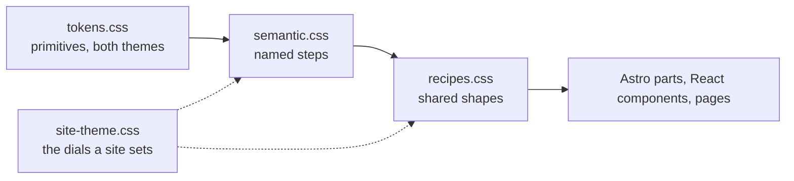

import AmbiqLogo from '@ambiqai/helia-ui/starlight/AmbiqLogo.astro';
import Callout from '@ambiqai/helia-ui/astro/Callout';
import MotionDemo from '../../components/MotionDemo.astro';
import SurfaceStack from '../../components/SurfaceStack.astro';
import TokenRuler from '../../components/TokenRuler.astro';
import TypeRamp from '../../components/TypeRamp.astro';
import TypographyShowcase from '../../components/TypographyShowcase.astro';

Every value a part draws with comes from a token, and every token belongs to
one of four files. This page is the tour of them: what each scale is for, what
each step looks like, and which page shows the token doing its job. The
[color reference](/helia-ui/foundations/tokens/) carries the values themselves,
generated from the token files, and the
[site theme](/helia-ui/foundations/site-theme/) page lists the dials a site is
free to move.

## How the layers stack

`tokens.css` holds the primitives both HELIA sites share and maps them onto
Starlight's `--sl-*` variables. `semantic.css` names the steps authoring uses:
spacing, radius, type, weight, leading, ink, surfaces, tones, accents.
`recipes.css` turns those into the shapes the parts share. `site-theme.css` is
the contract of dials a consuming site sets, which move the two layers under it
without forking either.

The three package sheets are unlayered on purpose, so they outrank every
cascade layer a Tailwind entry declares. That is what keeps a token
authoritative over whatever the Starlight Tailwind compat package wires up
underneath.

## Color

Four surfaces and four inks, both sets swapped by the theme flip. Nothing in
the package writes a color literal outside the token files; everything else
resolves through these.

  <figure>
    

    <figcaption>
      <code>--helia-surface-canvas</code>
    </figcaption>
  </figure>
  <figure>
    

    <figcaption>
      <code>--helia-surface-paper</code>
    </figcaption>
  </figure>
  <figure>
    

    <figcaption>
      <code>--helia-surface-card</code>
    </figcaption>
  </figure>
  <figure>
    

    <figcaption>
      <code>--helia-surface-card-muted</code>
    </figcaption>
  </figure>

  
    <code>--helia-ink-primary</code>
  
  
    <code>--helia-ink-secondary</code>
  
  
    <code>--helia-ink-muted</code>
  
  
    <code>--helia-ink-caution</code>
  

The accent set is the package's whole color vocabulary. There are no product
names in it: a consuming site maps its own subjects onto an accent in the
composition that knows what they mean, and hands it to a part as `--accent`.

  <figure>
    

    <figcaption>
      <code>blue</code>
    </figcaption>
  </figure>
  <figure>
    

    <figcaption>
      <code>cyan</code>
    </figcaption>
  </figure>
  <figure>
    

    <figcaption>
      <code>green</code>
    </figcaption>
  </figure>
  <figure>
    

    <figcaption>
      <code>orange</code>
    </figcaption>
  </figure>
  <figure>
    

    <figcaption>
      <code>pink</code>
    </figcaption>
  </figure>
  <figure>
    

    <figcaption>
      <code>purple</code>
    </figcaption>
  </figure>
  <figure>
    

    <figcaption>
      <code>red</code>
    </figcaption>
  </figure>
  <figure>
    

    <figcaption>
      <code>slate</code>
    </figcaption>
  </figure>

Every color token, its value in each theme, and the contrast each ink reaches
on the canvas and on the card are on the
[color reference](/helia-ui/foundations/tokens/). The accents are shown
carrying meaning on the [gallery](/helia-ui/gallery/#content-first).

<Callout tone="note" title="Accent is a custom property, not a prop">
  `Media` takes its color as `style="--accent: var(--helia-accent-cyan)"` rather
  than `accent="cyan"`. That is deliberate: a prop would be an enumeration the
  package has to own, and owning it would mean owning what each name is for. As
  a custom property the part never learns the vocabulary.
</Callout>

## Type

One ramp of thirteen sizes, five weights, three leadings, and six tracking
steps. A role is named before a size is chosen: `--helia-text-body` says what
the text is, where `0.94rem` says only how big it is. Tracking belongs to the
face rather than to the size, so a component that sets a letter-spacing of its
own is holding a value the ramp should own: uppercase labels take
`--helia-tracking-caps` and a wordmark takes `--helia-tracking-wordmark`, the
two steps that are roles rather than sizes.

<TypeRamp />

The [Primitives](/helia-ui/primitives/) page shows the ramp inside the parts
that use it, and the roles below read the same tokens as a page of copy does.

<TypographyShowcase />

## Space, radius, and control height

One spacing scale, six steps and a hairline. A part that takes a spacing prop
names a step rather than a length, so the same value reaches the part, the
recipe, and the Tailwind utility: the Tailwind entry maps each step onto
`--spacing-*`, which makes `p-3` and `padding: var(--helia-space-3)` the same
value by construction rather than by convention.

<TokenRuler
  kind="space"
  tokens={[
    '--helia-space-px',
    '--helia-space-1',
    '--helia-space-2',
    '--helia-space-3',
    '--helia-space-4',
    '--helia-space-5',
    '--helia-space-6',
  ]}
/>

Four radius steps derive from the `--helia-radius` primitive, so a site that
turns that one dial moves the whole set together. The pill sits outside the
scale, because a pill is a shape rather than a step.

<TokenRuler
  kind="radius"
  tokens={[
    '--helia-radius-xs',
    '--helia-radius-sm',
    '--helia-radius-md',
    '--helia-radius-lg',
    '--helia-radius-pill',
  ]}
/>

Control heights belong to the size step rather than to the recipe that draws
it. The Astro button and the React one are separate code paths, and reading the
same token is what puts them on the same row; the
[Cohesion](/helia-ui/react/cohesion/) page measures that they do.

<TokenRuler
  kind="control"
  tokens={['--helia-control-sm', '--helia-control-md', '--helia-control-lg']}
/>

## Elevation and surface tones

Depth is a surface tone first and a shadow second. A panel changes what it is
filled with to separate from the page, and casts one of three shadow steps when
it also has to sit above it. A hover lift moves one step, never two.

<SurfaceStack />

The tones are shown on the parts that carry them under
[Surface](/helia-ui/primitives/#surface), and the whole card family sits on
them on the [gallery](/helia-ui/gallery/).

## Motion

Three durations, one easing, and three travel distances, each duration
multiplied by a per-site dial and by the visitor's own. Reduced motion zeroes
both the dial and the distances, so a transition that survives has nothing left
to animate.

<MotionDemo />

The [gallery](/helia-ui/gallery/#reveal-on-scroll) carries every named
transition on one page, and [Layout](/helia-ui/layout/#showcase-carousel) shows
the reveal used at section scale.

## Status inks

Advisory color comes in pairs. The tone is the fill an icon, a rim, or an edge
takes, and the ink is the same meaning chosen as text: each ink clears 4.5:1
against the raised surface of the theme it is declared in. Anything that sets a
status color on a word takes the ink, never the fill.

  
    <code>--helia-tone-success-ink</code>
  
  
    <code>--helia-tone-warning-ink</code>
  
  
    <code>--helia-tone-critical-ink</code>
  
  
    <code>--helia-tone-important-ink</code>
  

The measured ratios are on the
[color reference](/helia-ui/foundations/tokens/#ink-on-surface), and
[Callouts](/helia-ui/callouts/) shows each tone and its ink in the part they
belong to.

## The Ambiq wordmark

The plugin's footer renders the approved Ambiq wordmark, and the component is
available on its own at `@ambiqai/helia-ui/starlight/AmbiqLogo.astro`. It keeps
the source artwork intact while exposing only the three approved treatments.

  

    <AmbiqLogo tone="blue" />
    Blue
  

  

    <AmbiqLogo tone="black" />
    Black
  

  

    <AmbiqLogo tone="white" />
    White
  

