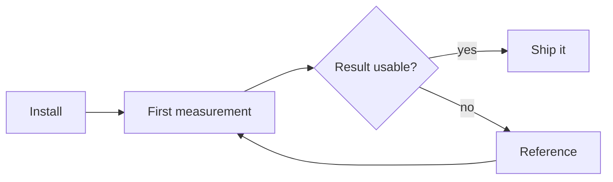

Guides explain. They carry the concepts a reader needs before a how-to makes
sense, the tradeoffs behind a default, and the background that would clutter a
task page.

A guide is the right home for a decision a reader has to make. A how-to is the
right home for a decision that has already been made for them.

## Diagrams

A ` ```mermaid ` fence renders to an inline SVG at build time and takes its
colours from the theme, so it costs no client JavaScript and follows dark mode.
Replace this one, or delete the section along with the `rehype-mermaid` entry in
`astro.config.mjs` if the site has no diagrams.


